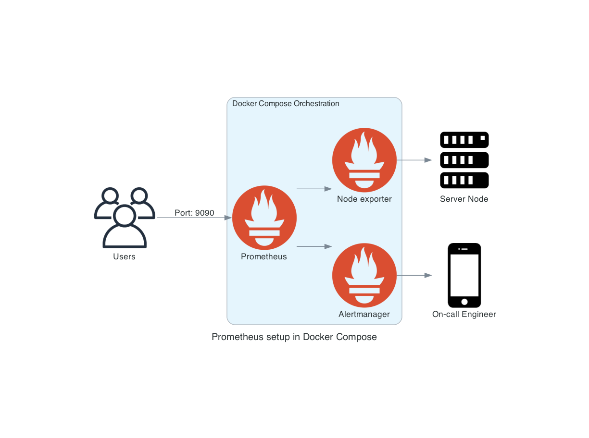

# Instructions

You can access a comprehensive tutorial of these examples on [this Medium Post](https://medium.com/@mxulises/simple-prometheus-setup-on-docker-compose-f702d5f98579).



## Pre-requisites:

 - [Install Docker](https://docs.docker.com/get-docker/)
 - [Install Docker Compose](https://docs.docker.com/compose/)

## Run the example
 1. Deploy orchestration including Prometheus, Node Exporter and Alertmanager:
    ```
    docker compose up -d
    ```
 1. Access the dashboards of the services you deployed:
    - Prometheus: [http://localhost:9090/](http://localhost:9090/)
    - Node Exporter: [http://localhost:9100/](http://localhost:9100/)
    - Alertmanager: [http://localhost:9093/](http://localhost:9093/)
 1. (Optional) You can stop Node Exporter container to generate an alert. This alert should be visible in both Prometheus and Alertmanager.
 1. Turn down your orchestration once you are done:
    ```
    docker compose down
    ```

