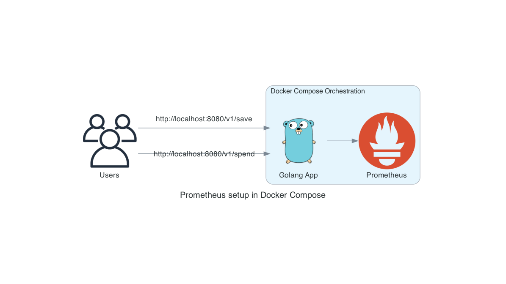

# Instructions

You can access a comprehensive tutorial of these examples on [this Medium Post](tbd).



## Pre-requisites:

 - [Install Docker](https://docs.docker.com/get-docker/)
 - [Install Docker Compose](https://docs.docker.com/compose/)
 - [Install Go](https://golang.org/) (Optional)

## Run the example
 1. Deploy orchestration including Prometheus, Node Exporter and Alertmanager:
    ```
    docker compose up -d
    ```
 1. Access the dashboards of the service you deployed:
    - Prometheus: [http://localhost:9090/](http://localhost:9090/)
 1. Access the endpoints of the Golang App (you can modify the `coins` as needed, non-positive values will generate errors)
    - Save : [http://localhost:8080/v1/save?coins=10](http://localhost:8080/v1/save?coins=10)
    - Spend : [http://localhost:8080/v1/spend?coins=10](http://localhost:8080/v1/save?spend=10)
 1. Turn down your orchestration once you are done:
    ```
    docker compose down
    ```

